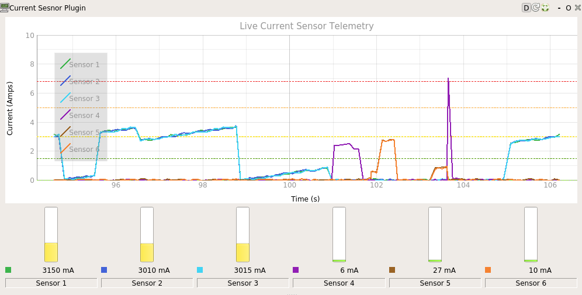

Rover UI
========

A ROS package containing the `rqt`_ plugins which make up the UI for the `NURover`_'s Watney Mk.2's Rover, completed for the `2020 University Rover Challenge`_.

.. _rqt: http://wiki.ros.org/rqt
.. _NURover: https://www.northeasternrover.com/
.. _2020 University Rover Challenge: http://urc.marssociety.org/home

Examples
--------

Copyright
---------

Copyright (c) 2020 Brian Schubert.